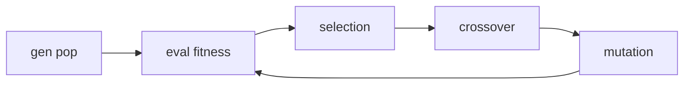

# Systemy Uczące Się K2 2024/2025

## Algorytmy genetyczne

Algorytmy przeszukujące przestrzeń rozwiązań oparte na mechanizmach doboru naturalnego i łączenia cech rozwiązań

- fenotyp/genotyp - rozwiązanie w postaci zbioru parametrów / zakodowana postać rozwiązania
- chromosom - rozwiązanie (wektor genów)
- allel - wariant (wartość) genu (cechy)
- locus - pozycja genu w chromosomie
- przystosowanie - fitness

### Typy reprodukcji

- ruletkowa - proporcjonalna do fitnessu
- rangowa - zależna od pozycji na liście posortowanej wg fitnessu
- turniejowa - wielokrotny wybór najlepszego osobnika z losowej podpopulacji

### Typy krzyżowania

- losowe
- krewniacze
- wg linii
- jedno/wielopunktowe
- dwu/wieloosobnicze
- wymiana/uśrednianie genów

### Metody kodowania

- binarne
- całkowitoliczbowe
- liczby rzeczywiste (fenotypowe)
- permutacyjne - cechy kodowane są przez pozycję genu
  - np. problem komiwojażera
- mieszane - cechy kodowane przez wartość i locus
- drzewa, grafy, itp.

### Dobór parametrów

- arbitralny
- heurystyczny
- ewolucyjny
  - podpopulacje (metaalgorytm)
  - kodowanie parametrów w genotypie

### Metody genetyczne vs tradycyjne metody szukania

- zakodowane parametry
- poszukiwanie w całej populacji rozwiązań
- sama funkcja celu
- probabilistyczne reguły wyboru

### FAQ

- niestabilność, brak zbieżności -> rekonfiguracja (zmiana położenia genów bez zmiany rozwiązania - kodowanie permutacyjne)
  - Partially Matched Crossover PMX
  - Order Crossover OX, Cycle Crossover CX  
- przedwczesna zbieżność -> mutacja++, model ze ściskiem, metody niszowe
- niestacjonarność środowiska -> diploidalność, polidiploidalność

### metody niszowe

- nisza - podpopulacja
  - ograniczenie migracji w sensie geograficznym
  - obniżenie funkcji przystosowania gdy osobnik jest "blisko" innych
    - odległość d obliczana na poziomie genotypu/fenotypu
  - wzorce skojarzeniowe - kojarzenie gdy qzorce dwóch osobników do siebie pasują

metody niszowe zapewniają lepszą różnorodność w populacji  
są dobre gdy przestrzeń rozwiązań ma lokalne maksima

### Diploidalność

zdwojenie (zwielokrotnienie) liczby homologicznych chromosomów

## Genetyczne systemy uczące się

środowisko - przydziela nagrody, wyznacza stan, jest niezależne od ucznia

- stacjonarność - zmienność w czasie
- determinizm - ta sama akcja daje te same stany

### regułowy vs globalny SUS

- globalny (Pittsburgh) - cały system regułowy jest pojedynczym osobnikiem
- rozproszony (Michigan) - każda reguła (klasyfikator) - jest pojedynczym osobnikiem
  - lepszy w środowiskach niestacjonarnych i o dużej liczbie stanów
  - trudność z zapewnieniem współpracy podrozwiązań
  - duża liczba parametrów algorytmu

### Systemy LCS - Learning Classifier Systems

- bucket brigade (alg. drużyny kubełkowej)
  - nagroda od środowiska dzielona jest pomiędzy reguły biorące udział we wnioskowaniu
  - reguły biorą udział w przetargu - oferty i nagrody
  - optymalizacja - podatek obniżający siłę reguły w czasie, zaszumianie efektywnej wysokości oferty
- Q-Learning - przystosowanie zależne od dokładności predykcji a nie siły reguły

## Uczenie ze wzmocnieniem

$\gamma$ - współczynnik dyskontowania

- =0 -> system patrzy tylko na najbliższe nagrody
- =1 -> system nie patrzy na czas
- przyspieszenie  osiągania celów

### MDP - Proces decyzyjny Markove

- stany
- akcje
- prawdopodobieństwa (stan, akcja) -> stan
- nagrody za (stan, akcja)

stacjonarne, z pełną informacją o stanie, nieciągłe parametry

### Monte-Carlo - duża liczba symulacji dla każdej pary (stan, akcja)

powolna zbieżność, nie wymaga dokładnej znajomości modelu środowiska

### programowanie dynamiczne

- równania Bellmana
- wymagana znajomość modelu środowiska
- słaba dla dużej ilości stanów

### metoda różnic czasowych

interaktywne uczenie funkcji użyteczności w każdym kroku

łączy cechy Monte Carlo i programowania dynamicznego

modyfikacja użyteczności stanu lub akcji na podstawie estymowanego zwrotu i dotychczasowej użyteczności

### Q-Learning

off-policy - użyteczność akcji modyfikowana w oparciu o estymowaną użyteczność w następnym kroku

### SARSA

on-policy - użyteczność estymowana w bieżącym kroku

### Gradient

aproksymacja funkcji

### Alpha Go

Rollout (monte Carlo) + Monte Carlo Tree Search
